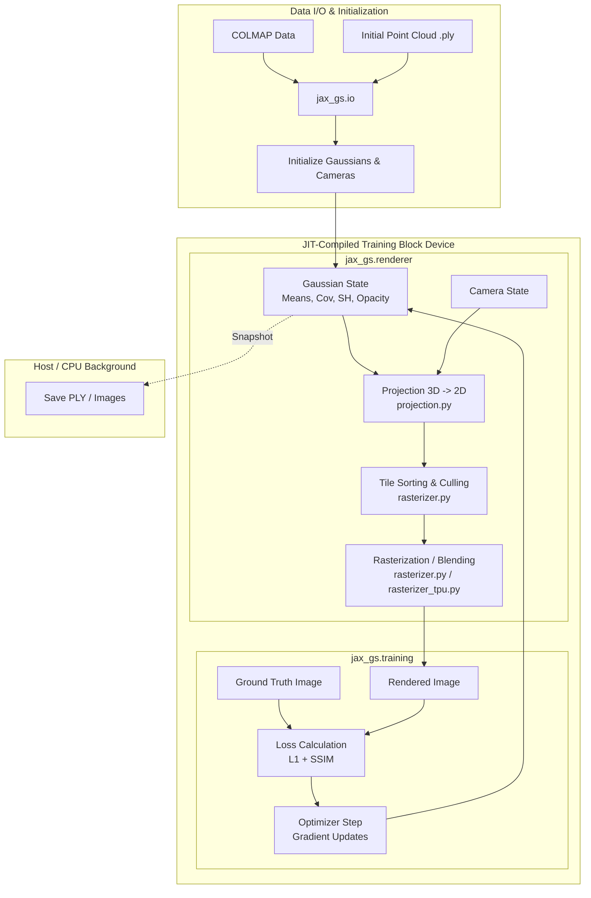

# Architecture Design: JAX-GS (Gaussian Splatting in JAX)

## 1. Overview

JAX-GS is a high-performance, pure-JAX implementation of 3D and 2D Gaussian Splatting (3DGS/2DGS). Unlike traditional PyTorch implementations that rely on custom, hardware-specific CUDA kernels, JAX-GS leverages JAX's composable transformations (`jax.jit`, `jax.vmap`, `jax.pmap`, and `jax.lax.scan`) and the XLA compiler to achieve hardware-agnostic acceleration.

The architecture is primarily designed to saturate Matrix Multiply Units (MXUs) on Google TPUs and Tensor Cores on NVIDIA GPUs by compiling massive training loops into single execution graphs, minimizing host-device dispatch overhead.

---

## 2. High-Level System Architecture

The system is broken down into modular packages, separating mathematical rendering logic from training loop orchestration and I/O.

---

## 3. Directory Structure and Core Modules

The repository employs a twin-architecture supporting both 3D and 2D Gaussian Splatting:

*   **`jax_gs/`**: The core 3D Gaussian Splatting implementation.
*   **`jax_2dgs/`**: A parallel module dedicated to 2D Gaussian Splatting (using flattened surfels instead of 3D ellipsoids).

### `jax_gs.core`
Defines the primary data structures.
*   **`gaussians.py`**: Handles the parameterization of Gaussians (Means, Quaternions/Rotations, Scales, Opacities, and Spherical Harmonics).
*   **`camera.py`**: Manages view matrices (W2C), projection matrices, and camera intrinsics.

### `jax_gs.renderer`
The mathematical engine for converting 3D representations into 2D images.
*   **`projection.py`**: Transforms 3D Gaussians into 2D screen-space bounds and computes the 2D covariance matrices.
*   **`rasterizer.py`**: The standard JAX rasterizer. It includes tile-based culling, bit-packed sorting, and front-to-back alpha blending using `jax.lax.scan`.
*   **`rasterizer_tpu.py`**: A specialized rasterizer optimized for TPUs, utilizing flat vectorization and `jax.checkpoint` to maximize MXU utilization and prevent Out-Of-Memory (OOM) errors during reverse-mode autodiff.

### `jax_gs.training`
*   **`losses.py`**: Implementations of combined L1 and D-SSIM losses.
*   **`trainer.py`**: Contains the state management and step functions for updating Gaussian parameters.

### `jax_gs.io`
*   **`ply.py`**: Utilities for reading and writing standard 3DGS `.ply` files (compatible with standard web viewers).
*   **`colmap.py`**: Parsers for COLMAP cameras, images, and sparse point clouds.

---

## 4. Execution Models

JAX-GS offers multiple execution strategies depending on the scale of the training workload.

### 4.1. Single-Device JIT Training (`train.py`)
Optimized for single GPU/TPU performance.
*   **On-Device Loop**: Uses `jax.lax.scan` to compile an entire block of training steps (e.g., 500 steps) into a single XLA graph.
*   **Zero-Transfer Sampling**: Datasets are loaded onto the device memory upfront. Random sampling of views occurs natively on the device, eliminating PCIe/Host transfer bottlenecks.
*   **Asynchronous I/O**: Checkpointing and rendering outputs are handled by background CPU threads to ensure the accelerator never waits for disk operations.

### 4.2. Multi-Device Data Parallelism (`train_parallel.py`)
Optimized for multi-GPU or TPU Pod configurations.
*   **`jax.pmap`**: Replicates the Gaussian model across all available devices.
*   **Parallel Execution**: Each device samples a different camera view, computes the forward and backward pass independently.
*   **Cross-Device Synchronization**: Uses `jax.lax.pmean` to average gradients across the Torus network (TPU) or NVLink (GPU) before applying the optimizer step, effectively multiplying the batch size linearly.

---

## 5. Key Architectural Innovations

### Pure JAX "Pseudo-Kernels"
Rather than writing custom CUDA (which lacks native TPU support), the rasterizer logic is expressed as pure JAX array operations.
*   **Bit-Packed Sorting**: Tile interactions are assigned a composite 32-bit integer key (`[Tile ID: 18 bits][Depth: 13 bits]`). This allows a single vectorized `jax.lax.sort_key_val` to perform both spatial grouping and depth ordering.

### TPU Saturation Strategy
*   Instead of nested maps (tiles -> pixels) which fragment computation, the TPU rasterizer flattens memory domains to create massive contiguous arrays (`[num_tiles, 256]`), ensuring the Systolic Arrays remain saturated.
*   **`jax.checkpoint` (Rematerialization)**: Applied rigorously in the inner rendering loops to trade compute for memory. By recomputing forward-pass variables during backpropagation, memory scales linearly with block size rather than exploding, making high-resolution splatting viable on constrained accelerator memory limits.